# 問題闡述

---

## 兩個重複性的工作

- **SD方案階段/ 外牆排列方案**
- **DD建照階段/ 排煙窗檢討**

---

## SD方案階段/ 外牆排列方案

跟業主討論外牆面板排列方案，每種方案都要一片片手動改 Revit

---

## DD建照階段/ 排煙窗檢討

每個房間都要對照法規算一遍，還要再手動整理成 Excel 給技師看

---

## 傳統作法耗費時間

| 工作項目       | 傳統做法                                | 耗時估算            |
| -------------- | --------------------------------------- | ------------------- |
| 帷幕牆面板方案 | 手繪/AI Studio 小工具+ Revit 手動逐格改 | 每個方案 0.5-1 小時 |
| 排煙窗法規檢討 | 對照法規逐間計算 + 手動整理 Excel       | 一棟建築 半天起     |

> 講者備註：強調這不是「技術展示」，是真實工作中的痛點。「我不是工程師，我只是很厭倦重複做這些事。」

---

# 解方

---

## AI協作流程

1. 提供 AI 我已知的工作流程
2. 持續和AI討論規格，讓AI 補充細節、闕漏、矛盾點，或上網搜尋最佳實踐，並協助建立流程圖
3. 最後請AI依規格開發出MCP工具

---

## 層級關係：Skill（技能）、Domains（領域知識）、Tools（工具）

1. **Skill (技能)**：解決問題的「大類別」（例如：【法規自動化檢討】）
2. **Domains (領域)**：解決特定法規或特定工作流的「邏輯組合」（例如：排煙窗檢討、居室採光檢討）
3. **Tools (工具)**：執行任務的「最小單元」，具備高度共用性（例如：`get_room_info`、`create_dimension`）

---

## Skill-Domains-Tools 三者關係舉例-1

### Domain 共用 Tool

+ **【排煙窗檢討 Domain】** 需要：tool"取得房間面積" (取 2%) + tool"取得窗戶面積" (取折減係數)。
+ **【採光檢討 Domain】** 需要：tool"取得房間面積" (取 1/8) + tool"取得窗戶面積" (取台度 75cm 以上)。
+ **技術共享**：雖然法規檢討流程中，有效面積計算不同，但「取得房間面積、取得窗戶面積」的動作是重疊的。
---

## Skill-Domains-Tools 三者關係舉例-2

### Tool 被多個 Domain 共用

+ 在 **【排煙檢討】** 中：用來標註窗戶在「天花板下 80cm 有效帶」內的實際開啟高度。
+ 在 **【走廊分析】** 中：用來標註走廊的淨寬度。
+ 在 **【自動標註】** 中：用來標註房間與四周牆體的距離（如：`check_exterior_wall_openings`）。
+ **結論**： 只需要開發一次 `create_dimension` 的 C# 命令，就能支援多個不同 Domains 的視覺化回饋。

---

# Domain 案例一 排煙窗法規檢討
---

## 排煙窗法規檢討成果

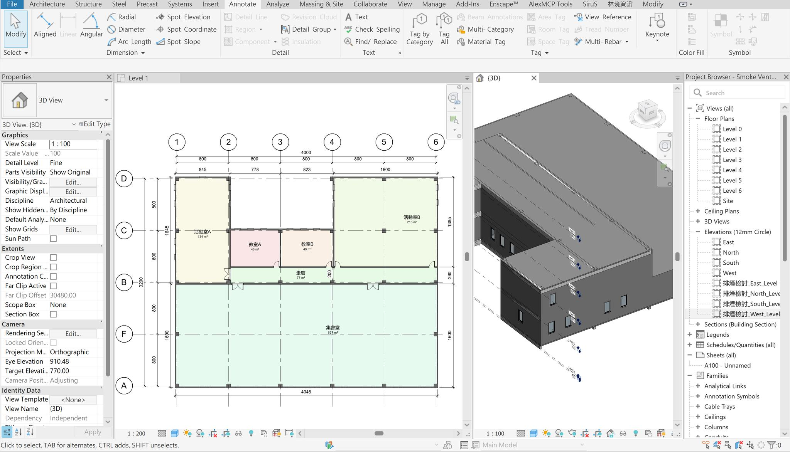
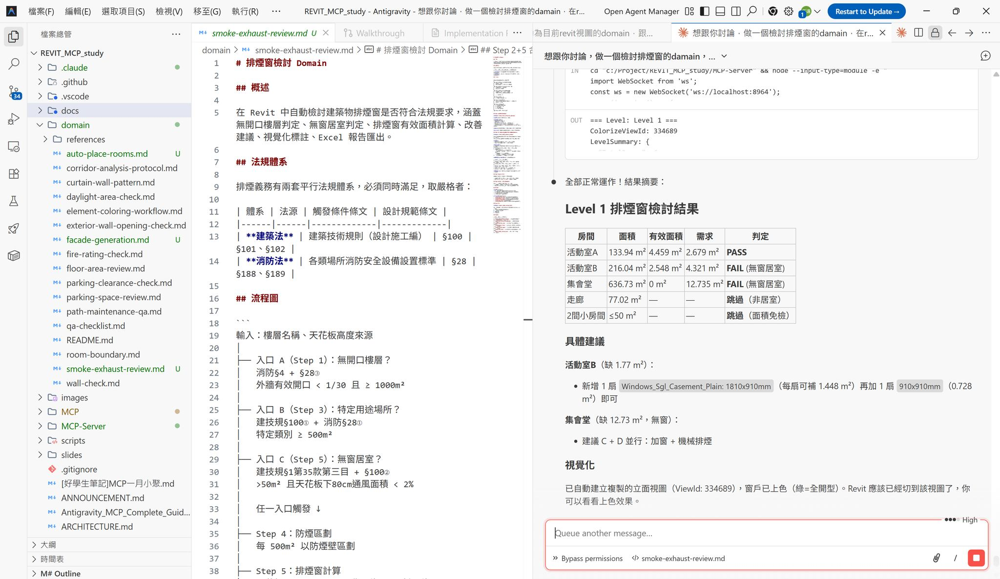
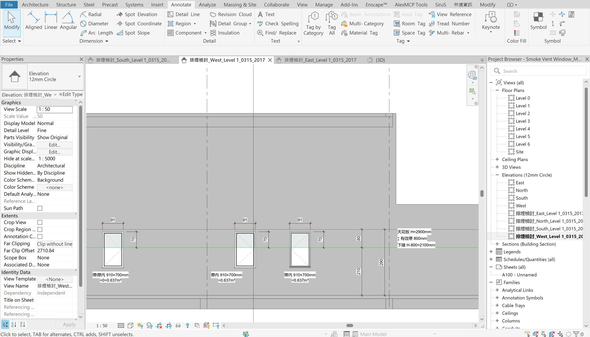

---

## 跟AI討論規格-1：從我知道的兩件事開始

+ 前言：上次聽 David 聽分享居室採光法規檢討，想到自己之前算很久的排煙窗也可以檢討
+ 我的目標：盡量透過窗戶排煙，而不要設置排煙設備。
  但同時盡量不新增窗型，維持立面設計與窗型規格數。

1. 所有樓層需設置排煙設備：
   `當層樓地板面積≥ 1000m²` 且 `當層有效開口面積 > 當層樓地板面積1/30`
2. 單一居室需設置排煙設備：
   `居室面積> 50m²`且 `天花板下80cm有效通風面積 < 該居室面積2%`

> 講者備註：停頓一下。「你們猜，我漏掉什麼了？」這是互動點。漏掉的其實很多：折減係數、無開口樓層、防煙區劃、消防法與建築法兩套體系……這些是 AI 幫我補充的。

---

## 跟AI討論規格-2：AI 幫我補齊的部分

1. 更上層的事情：特定用途場所，該用途 `總樓地板面積≥ 500m²`  就需要設置排煙設備
2. 若空間更大：防煙區劃（每 500 m² 一個區），依區劃檢討
3. 窗戶開啟方式的折減（固定窗 = 0；開啟角度<45度需要折減）

> 講者備註：「這正是建築師跟 AI 合作最有價值的地方：我提供領域知識的主幹，AI 幫我補充我沒想到的細節。最後跑出來的流程圖，我能看懂每一條，因為本來就是我自己知識的延伸。」

---

## 跟AI討論規格-3：我希望輸出給技師的部分

1. 溝通用圖說：標出天花下 80cm 的範圍線，並標註出有效範圍內的開口長寬
2. Excel 列出各房間與窗的對應明細

---

## 跟AI討論規格-4：整理出完整流程

- 自動讀取每個房間的窗戶、天花板高度
- 計算有效帶（天花板下 80 cm）內的可開啟面積
- 對照 2% 門檻判定合規
- 在 Revit 裡直接建立新的剖面視圖
- 畫出天花線、有效帶範圍、標上尺寸數字

---

## 跟AI討論規格-4-1：流程圖

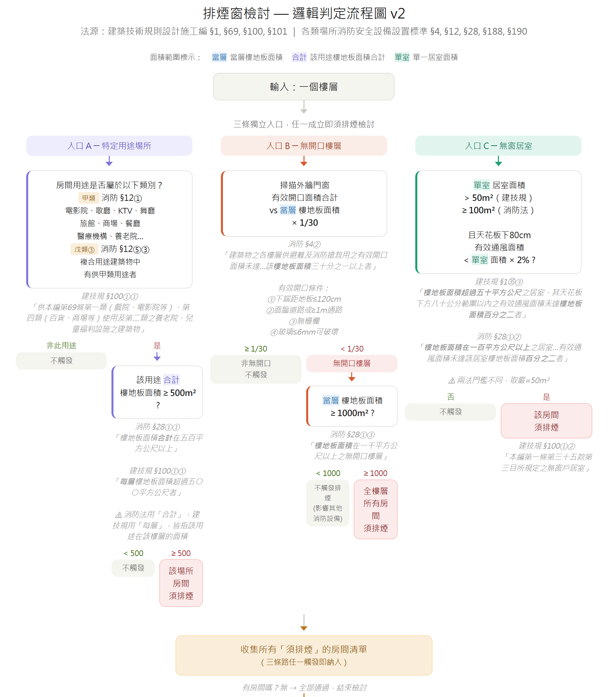
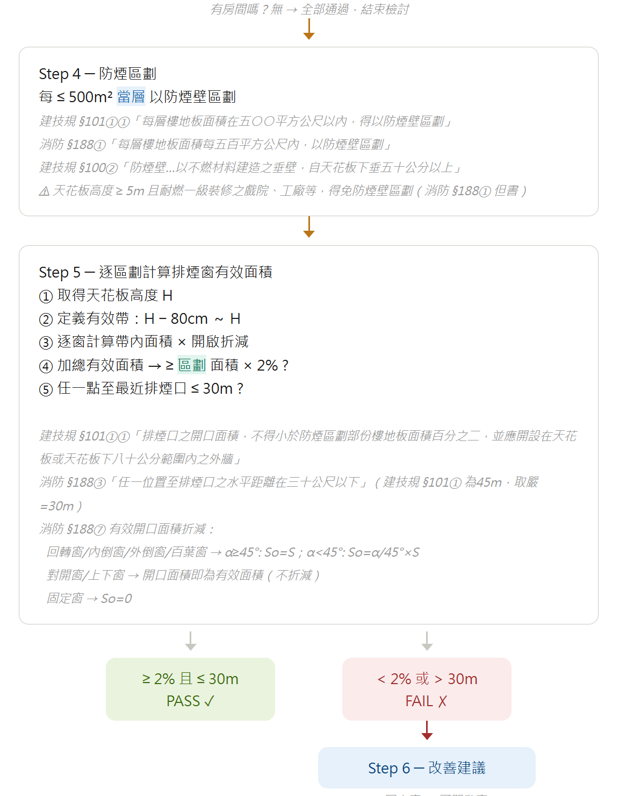


---

## 跟AI討論規格-5：輸出 Excel 的詳細內容

- 5 個工作表：樓層總覽 / 房間明細 / 窗戶明細 / 改善建議 / 補充法規
- 判定結果標色（PASS 綠 / WARNING 橘 / MANUAL 藍）
- 直接交給消防技師，不需要再整理
- AI 建議「現有的窗型還需要補幾個」
- 不自動新增窗型，只給建議


> 講者備註：「為什麼不讓 AI 直接幫你新增窗型？因為那是設計決策。也許你要換窗型，也許要改天花高度，也許要做機械排煙。這個判斷必須是建築師來做。AI 給你數字，你做決定。」

---

## 請AI依規格寫程式

- 先確認目前專案已有的Tools，哪些可以重複利用？哪些這次要新開發出來？

可重複利用的 tools

| 工具名稱            | 功能說明                                   | 相關 Domain                                                                  |
| ------------------- | ------------------------------------------ | ---------------------------------------------------------------------------- |
| create_detail_lines | 在視圖中繪製詳圖線（如天花線、有效帶界線） | 是 (共用於 stair-hidden-line-workflow.md)                                    |
| create_dimension    | 建立尺寸標註（標註窗寬、窗高、有效高度）   | 是 (廣泛共用於 corridor-analysis-protocol.md, auto-dimension-workflow.md 等) |

+ 這次要新開發出來的 tools

| 工具名稱                       | 功能說明                               | 相關 Domain |
| ------------------------------ | -------------------------------------- | ----------- |
| check_smoke_exhaust_windows    | 排煙窗有效面積檢核與無窗居室判定       | -           |
| check_floor_effective_openings | 依消防法規判定是否為無開口樓層         | -           |
| export_smoke_review_excel      | 匯出排煙檢討專用的 Excel 報告          | -           |
| create_section_view            | 建立面向外牆的剖面視圖以供檢討         | -           |
| create_filled_region           | 建立填充區域（用於視覺化有效排煙範圍） | -           |
| create_text_note               | 建立文字標註（用於統計摘要顯示）       | -           |

---


## 排煙窗法規檢討Excel輸出成果

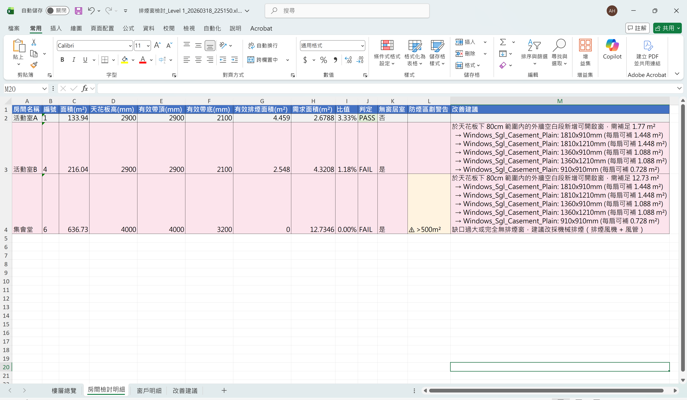
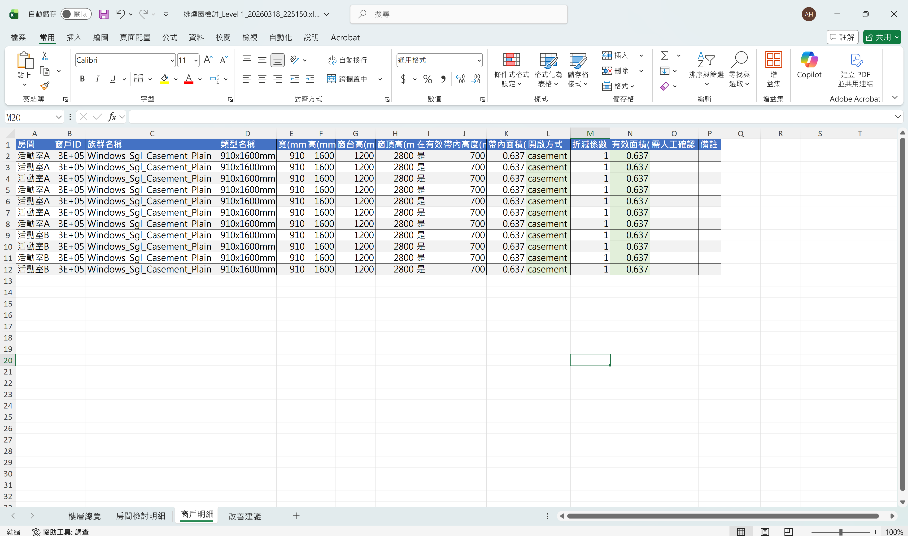
---
## 待改善項目

+ 立面圖天花標示尚不穩定，需繼續調整

---

# Domain 案例二 帷幕牆面板排列

---

## 帷幕牆面板排列成果

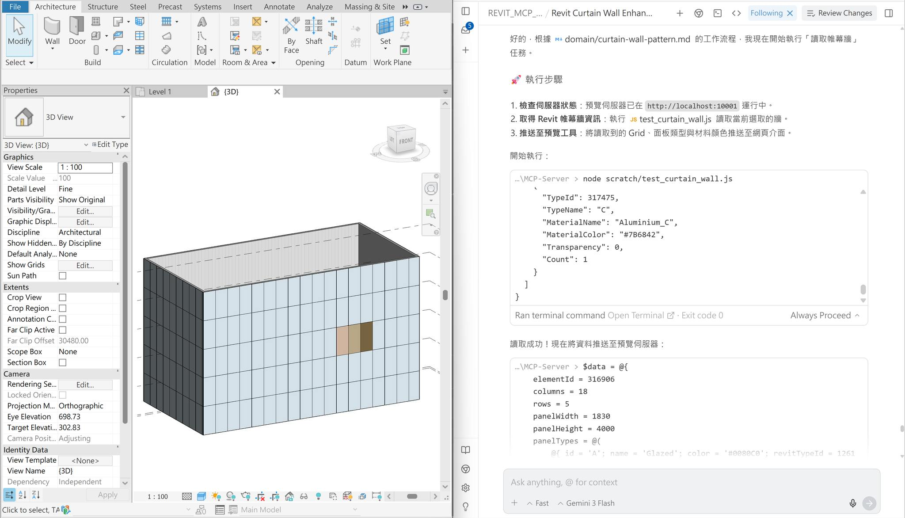
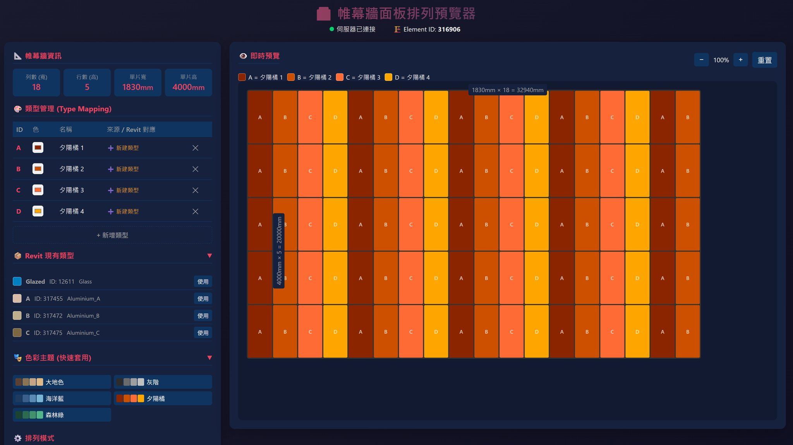

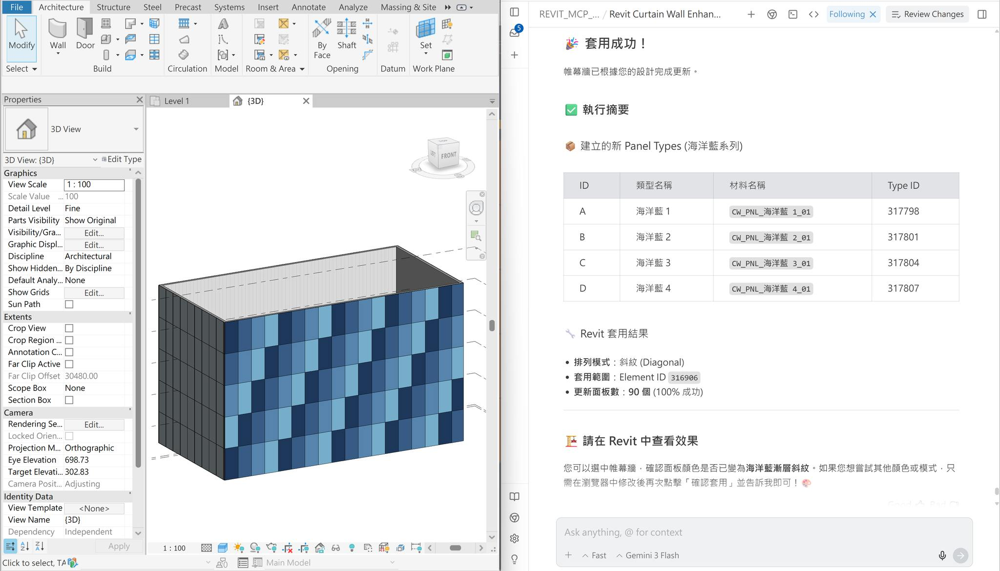

---

## 舊做法：用很多工具拼湊

- Step 1：在 Google AI Studio 設計面板排列方式
- Step 2：鋪面：匯出.dxf，link到 Revit 重繪
- Step 3：帷幕面板：匯出圖檔，用眼睛看著，在 Revit 一格一格改 Type
- 每換一個方案，就重複一次......

```
Gemini Canvas 做的工具
- 建築立面設計
https://gemini.google.com/share/993314c3bdb4
- 對縫鋪面產生器
https://gemini.google.com/share/a7f8fb9dbb09

Google AI Studio 做的工具
- 建築平面案例分析工具
https://aistudio.google.com/apps/drive/1xl7FRgUViwfUmtku_yTlBoonVJrq8Zkn?fullscreenApplet=true
```

---

## 舊做法: 以前寫的小工具

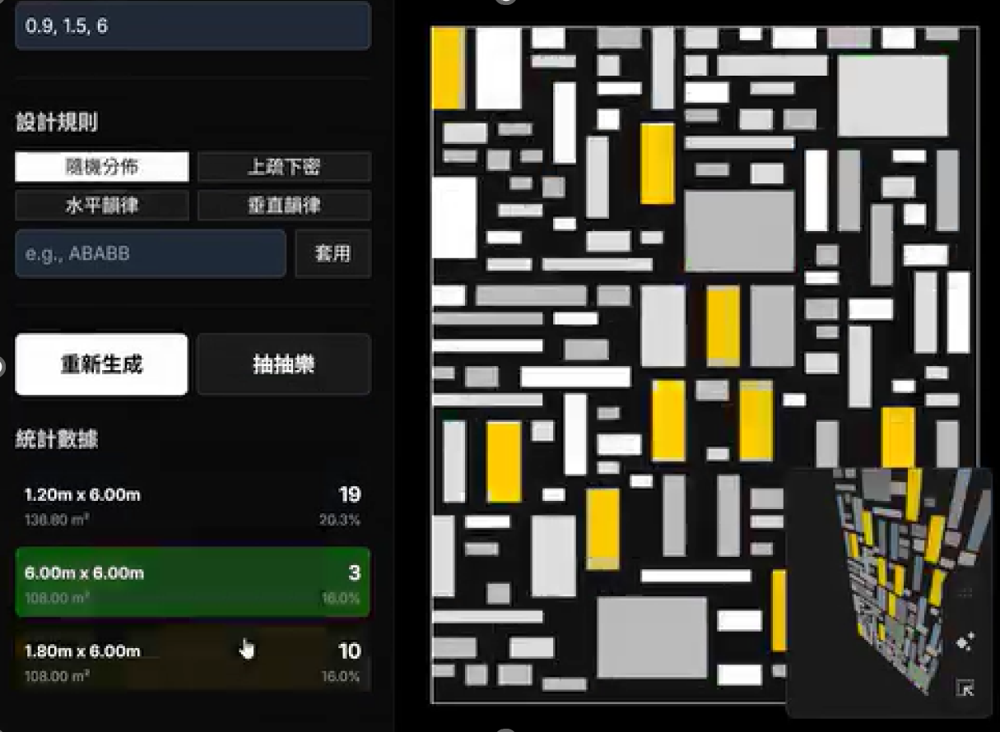
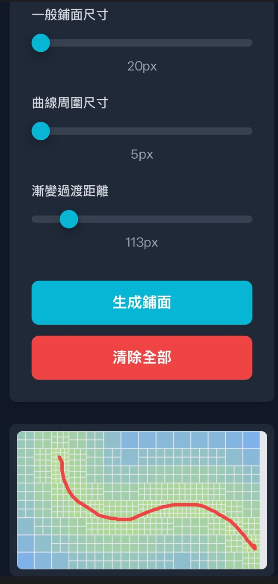
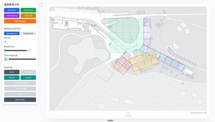

---

## 舊做法: 以前寫的小工具 - 影片


---

## 嘗試改進：用手打編號，以MCP寫入Revit

+ 一開始的想法：用文字編號的方式貼給AI，再請他排列

```
121212　　ABBABBA　　ABCD
121212　　ABBABBA　　BCDA
122122　　ABBABBA　　CDAB
121212　　ABBABBA　　DABC
```
+ 和AI討論後：
  發現手打編號不直覺，沒有即時視覺反饋，
  建議新增一個網頁預覽介面來溝通。

---

## 網頁預覽介面通訊協定筆記

- Note：
  **網頁預覽介面**：通訊用HTTP / REST API 來讀寫，只需要在「開始」「結束」時傳大批資料（像「公文往返」）
  **MCP Server與Revit**：通訊用WebSocket ，適合即時頻繁操作。（像「電話直通）

---

## 新做法：設計完直接套用

```
選取 Revit 帷幕牆
       ↓
自動讀取帷幕網格（幾行幾列、已有的類型）
       ↓
在瀏覽器中視覺化設計
（現有或新類型 / 色彩主題 / 排列模式...）
       ↓
確認套用
       ↓
Revit 模型自動更新
```

---

## 網頁介面：所見即所得

- 左側控制列：選擇排列模式、自訂色彩主題
- 右側預覽列：Grid 結構預覽（與 Revit 等比例）
- 確認後自動建立所需的面板類型


---

## 帷幕牆面板排列操作影片

---

# 結尾


---

## 工作流程的改變

| 工作環節       | 以前                  | 現在                          |
| -------------- | --------------------- | ----------------------------- |
| 帷幕方案討論 | 手動改 Revit × 方案數 | 網頁預覽確認 → 一鍵套用       |
| 排煙法規核對   | 對著條文逐間計算      | 自動計算 + 視覺化標示         |
| 給技師的資料 | 手動整理 Excel        | 自動匯出，含判定色碼          |
| 不足的窗戶     | 自己推算              | AI 給多個建議，人決定怎麼補 |
| 設計決策       | 重複勞動後很累的人    | 看著AI依SOP做出的成果，有足夠時間、精神做判斷的人            |

---

## 我從這兩個案例學到的事

+ 兩個 domain 都是先討論規格，經過多輪對話，確認 md 檔中的內容與流程正確完整後，再一次請 AI 把程式寫完（C#，即 .cs 檔）
  + Part 1 帷幕牆面板排列：用 Claude 討論，Gemini Flash 寫程式
  + Part 2 排煙窗法規檢討：用 Claude 討論 + 寫程式

---

## 總結

- 從已知的工作流程出發，讓AI逐步補齊漏洞、跑重複性SOP
- 讓AI在關鍵節點提供建議，設計者做決定

---